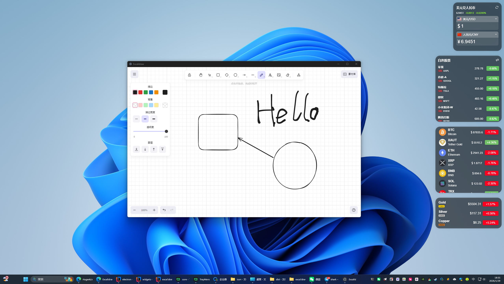
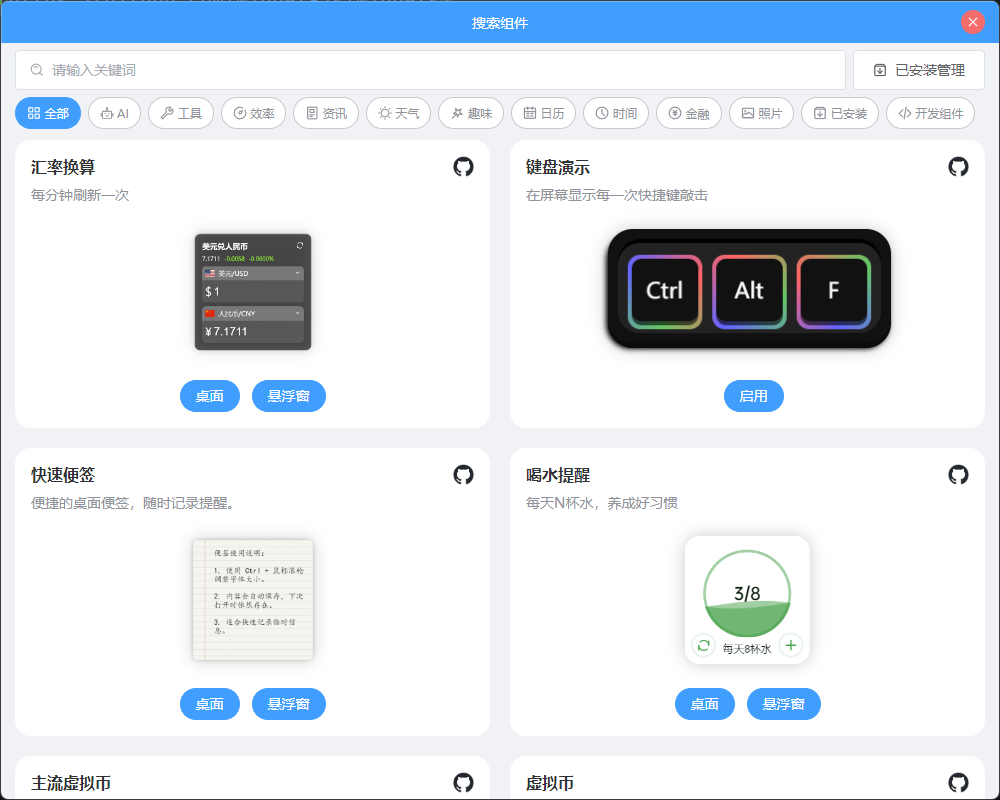

# Excalidraw Widgets

这是一个为 [Widget.js](https://github.com/widget-js/widgets) 打包的 Excalidraw 小部件（widget），方便用户`离线`打开一个可交互的 Excalidraw 画布。

- 支持：快速在页面中插入可绘图、可编辑的草图板。
- 场景：文档注释、协作白板、笔记和演示中的快速图示。

Quick summary (English):

This repository contains an Excalidraw widget packaged for Widget.js. The widget provides an embeddable, fully interactive Excalidraw canvas that can run inside Widget.js-compatible hosts. It is designed to work offline once installed, allowing users to sketch, annotate, and do lightweight diagramming directly within the host UI without relying on a remote Excalidraw service.

Usage

1. Build or package the widget (see this project's `package.json` scripts and `widget.json` for build/packaging metadata).
2. Install or register the widget with your Widget.js host according to the host's widget installation process.
3. Insert or embed the widget where you need an interactive drawing surface in your page or dashboard.

Notes

- Offline-ready: after installation the widget works without a network connection (persistence and exact behavior depend on the host environment).
- Check `widget.json` for manifest metadata and any host-specific requirements.

Links

⬇️ [Download](https://widgetjs.cn)
🔗 [All Widgets](https://github.com/widget-js/widgets)

